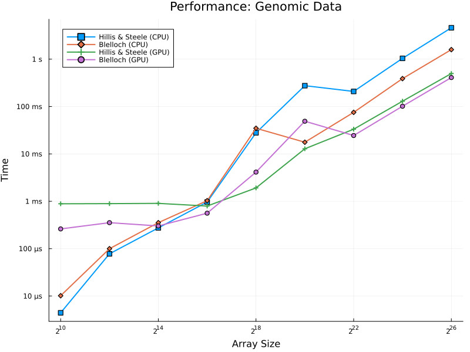
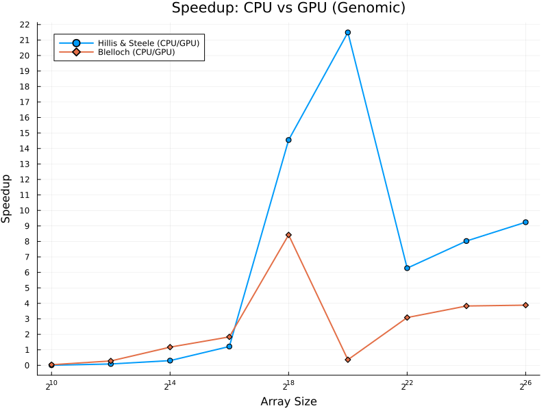
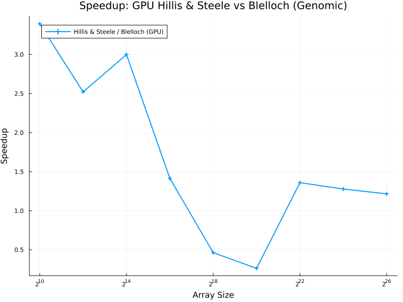

# ⚡ GPU Prefix Sums in Julia: Hillis & Steele vs. Blelloch

This project presents a **comparative performance study** of two foundational parallel prefix sum algorithms — **Hillis & Steele** and **Blelloch** — implemented in **Julia** using **CUDA.jl** for GPU acceleration. Prefix sum (scan) operations are essential in many high-performance computing applications including sorting, histogram generation, stream compaction, and genomic data analysis.

The aim of this project is to analyze and benchmark these algorithms across various dimensions, including:
- Execution speed on CPU vs GPU
- Efficiency across different data distributions
- Application to real-world data such as **MNIST images** and **genomic sequences**

---

## 📌 Key Features

- 📈 Benchmarks of CPU and GPU versions for both algorithms
- 🧬 End-to-end genomic data processing pipeline using prefix sums
- 🧪 Comprehensive test cases for validation and performance analysis
- 📊 Visualization of execution time, CPU vs GPU speedup, and GPU vs GPU performance
- 🧠 Implemented entirely in **Julia** with support for **CUDA.jl** and **BioSequences.jl**

---

## 🧠 Algorithm Overview

### Hillis & Steele
An inclusive scan algorithm based on step-wise doubling. Offers high CPU vs GPU speedup but is work-inefficient on GPUs due to repeated memory accesses.

### Blelloch
A work-efficient scan algorithm using a two-phase **upsweep** and **downsweep** strategy. Better suited for modern GPU architectures with optimized thread and memory utilization.

---

## 🧪 Data Types & Distributions

The algorithms were evaluated on a variety of input types:
- 📊 **Synthetic Distributions**: random, sparse, skewed, sorted, alternating
- 📷 **MNIST**: flattened image data for structured workload simulation
- 🧬 **Genomic Sequences**: simulated DNA strings processed to create rank tables using scan operations

Each data type helps evaluate behavior under different memory and compute load patterns.

---

## 📁 Repository Structure

```
root/
├── algorithms/
│   ├── hillis_steele.jl
│   ├── blelloch.jl
│   ├── kernels.jl
├── applications/
│   └── genomic/
│       ├── genomic_main.jl
│       └── genomic_utils.jl
├── benchmarks/
│   ├── main.jl
│   ├── utils.jl
├── common.jl
├── plots/
└── README.md
```

---

## 📊 Performance Summary

| Dataset        | Hillis-Steele Speedup (CPU vs GPU) | Blelloch Speedup | GPU-to-GPU Comparison |
|----------------|-------------------------------------|-------------------|------------------------|
| Random         | 10×                                | 6×                | Blelloch 1.8× faster   |
| Sparse         | 16×                                | 6×                | Blelloch 1.6× faster   |
| Skewed         | 33×                                | 6×                | Blelloch 1.7× faster   |
| Sorted         | 25×                                | 6×                | Blelloch 1.6× faster   |
| Real-world     | 18×                                | 6×                | Blelloch 1.7× faster   |
| MNIST          | 11×                                | 6×                | Blelloch 1.8× faster   |

> Blelloch consistently outperformed Hillis & Steele on GPU-only comparisons, while Hillis & Steele delivered better CPU-to-GPU speedup. Array sizes ranged from 1,024 to 67,108,864 elements

---

## 🧬 Genomic Application

- **Context**: Genomic applications often require computing **rank tables** for DNA sequences.
- **Implementation**:
  - DNA sequences are encoded into four binary arrays (A, C, G, T).
  - Prefix sum is applied to each array using both algorithms on CPU and GPU.
  - The result is a rank table for genome indexing.
- **Observations**:
  - Hillis & Steele performed better for small to mid-size inputs.
  - Blelloch scaled more efficiently for large sequences and maintained stable performance.

---

## 📊 Visual Results

### Execution Time on Genomic Data


### CPU vs GPU Speedup (Genomic)


### GPU vs GPU Speedup (Hillis & Steele vs Blelloch)

